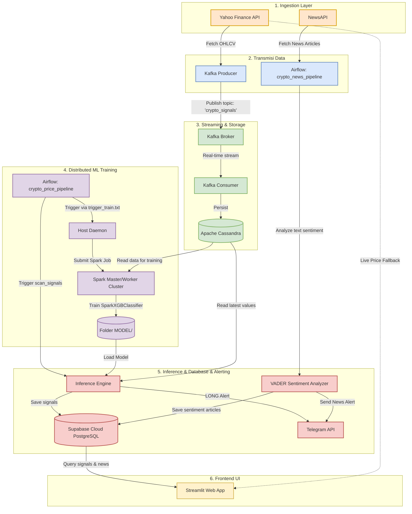

# 📖 Dokumentasi Teknis ROSBD Crypto Signals: Metodologi, Arsitektur E2E, & Implementasi Big Data

Dokumen ini menjelaskan secara rinci metodologi, arsitektur *end-to-end* (E2E), strategi visualisasi, evaluasi model *machine learning*, dan alur teknis implementasi Big Data pada proyek **ROSBD Crypto Signals**.

---

## 1. Metodologi

Sistem ini dirancang untuk mendeteksi potensi **Volatility Breakout (Lonjakan Volatilitas)** pada 5 aset kripto utama (*BTC, ETH, SOL, XRP, dan BNB*) menggunakan pendekatan *Machine Learning* berbasis klasifikasi biner dan analisis sentimen pasar global secara *real-time*.

### A. Metode Prediksi Volatilitas (Volatility Breakout)
Sistem tidak memprediksi arah harga secara langsung (naik/turun) melainkan memprediksi **apakah dalam 3 jam ke depan akan terjadi lonjakan volatilitas (perubahan harga yang signifikan)** melampaui batas ambang tertentu (*threshold*).
*   **Target Klasifikasi ($Target\_Vol$):**
    $$Target\_Vol = \begin{cases} 
      1, & \text{jika } \frac{|Close_{t+3} - Close_t|}{Close_t} \ge Threshold \\ 
      0, & \text{lainnya} 
    \end{cases}$$
*   **Threshold Aset:**
    *   **Koin Major (BTC, ETH, BNB):** $1.0\%$ ($0.010$) karena volatilitas harian relatif lebih stabil.
    *   **Koin High-Beta (SOL, XRP):** $1.8\%$ ($0.018$) karena memiliki fluktuasi pergerakan harga yang lebih tinggi.

### B. Rekayasa Fitur (Feature Engineering)
Fitur-fitur diekstrak secara otomatis dari data historis OHLCV (Open, High, Low, Close, Volume) di Cassandra:
1.  **Momentum Historis:** Return harga pada interval 1 jam (`Return_1h`), 3 jam (`Return_3h`), dan 12 jam (`Return_12h`).
2.  **Indikator Tren Makro:** Menggunakan Exponential Moving Average periode 50 (`EMA_50h`). Tren dikategorikan biner (`Trend_Direction = 1` jika harga berada di atas EMA 50).
3.  **Kompresi Bollinger Bands:** Mengukur posisi harga saat ini terhadap batas atas dan batas bawah Bollinger Bands 12 jam (`BB_Position`).
4.  **Rezim Volatilitas Pasar:** Membandingkan bandwidth Bollinger Bands saat ini dengan rata-rata bergeraknya (`Volatility_Regime`) untuk mendeteksi fase akumulasi (kompresi) sebelum *breakout*.
5.  **Akselerasi Volume:** Rasio volume saat ini terhadap Moving Average 12 jam (`Volume_Ratio`).
6.  **Fitur Jangkar (BTC Anchor):** Volatilitas BTC dalam 1 jam (`BTC_Vol_1h`) dan 3 jam (`BTC_Vol_3h`) digunakan sebagai proksi sentimen pasar keseluruhan untuk koin non-BTC (altcoins).

### C. Proteksi Kebocoran Data (Data Leakage Protection)
> [!IMPORTANT]
> Untuk mencegah model melihat data masa depan selama fase pelatihan (*data leakage*), semua fitur prediktif digeser sebanyak 1 langkah waktu (`shift(1)`) ke belakang. Dengan demikian, model hanya menggunakan informasi yang benar-benar telah terbentuk pada waktu $t$ untuk memprediksi kejadian di waktu $t+3$.

### D. Analisis Sentimen Fundamental (VADER Custom Lexicon)
Sistem menarik berita ekonomi dan geopolitik global menggunakan NewsAPI. Teks berita (judul + deskripsi) kemudian dianalisis menggunakan algoritma **VADER (Valence Aware Dictionary and sEntiment Reasoner)** dari library NLTK.
*   **Kustomisasi Kamus (Lexicon):** Kamus VADER diperkaya dengan kosakata khusus industri kripto untuk meningkatkan akurasi klasifikasi:
    ```python
    crypto_lexicon = {
        'bullish': 2.0, 'bearish': -2.0, 'pump': 1.5, 'dump': -1.5,
        'scam': -2.5, 'hack': -2.0, 'surge': 1.5, 'collapse': -2.5,
        'war': -2.0, 'attack': -1.5, 'ban': -2.0, 'etf': 1.5
    }
    ```
*   **Klasifikasi Sentimen:** Berita diklasifikasikan menjadi **POSITIVE** (skor $\ge 0.05$), **NEGATIVE** (skor $\le -0.05$), atau **NEUTRAL** di antara keduanya.

---

## 2. Arsitektur End-to-End (E2E)

Sistem ini dibangun di atas infrastruktur hybrid terdistribusi (Docker Container + Windows Host Daemon) menggunakan arsitektur orkestrasi berbasis event.

### A. Diagram Alur Sistem E2E



### B. Penjelasan Komponen Utama

#### 1. Ingestion Layer (Producer)
*   **Kafka Producer (`src/ingestion/kafka_producer.py`):** Dijalankan secara berkala oleh Airflow. Tugas utamanya adalah memeriksa data terakhir di Cassandra untuk masing-masing koin. Jika data tertinggal atau membutuhkan pembaruan *real-time*, Producer menarik data harga termutakhir dari Yahoo Finance API, menyusunnya dalam objek JSON, dan mempublikasikannya ke Kafka Broker pada topik `crypto_signals`.
*   **News Collector (`src/ingestion/news_collector.py`):** Menarik artikel berita finansial makro global dari NewsAPI setiap 5 menit.

#### 2. Streaming & Storage Layer (Consumer & Cassandra)
*   **Kafka Broker (`crypto_kafka`):** Berjalan di dalam container Docker sebagai *message broker* penengah yang andal, memproses antrean pesan streaming harga dengan replikasi tunggal.
*   **Kafka Consumer (`src/storage/kafka_to_cassandra.py`):** Service yang selalu aktif (*restart: always*) di Docker. Consumer mendengarkan topik `crypto_signals` secara real-time, mem-parsing pesan JSON, dan menyimpannya secara persisten ke tabel `crypto_ks.signals` di database Apache Cassandra.
*   **Apache Cassandra (`crypto_cassandra`):** Database NoSQL terdistribusi yang efisien dalam menangani penulisan data berkecepatan tinggi. Desain skemanya menggunakan `token` sebagai *Partition Key* dan `datetime` sebagai *Clustering Key* untuk memastikan optimasi query berdasarkan deret waktu.

#### 3. Distributed Compute & Machine Learning (Spark Cluster)
*   **Apache Spark Master & Worker:** Dijalankan di host lokal untuk memanfaatkan kapasitas RAM dan CPU fisik secara maksimal tanpa batasan isolasi resource Docker.
*   **SparkXGBClassifier (`src/models/train_model.py`):** Modul training membaca data dari Cassandra secara efisien menggunakan `pyspark`. Proses klasifikasi dipecah secara terdistribusi pada executor node. Model XGBoost dilatih dan diekspor dalam format JSON Booster (`{token}_xgb_model.json`).

#### 4. Operational Inference & Notification Layer
*   **Inference Engine (`src/signals/generator.py`):** Membaca data terbaru dari Cassandra, mengekstrak fitur melalui `CryptoFeatureEngineer`, memuat model dari folder `MODEL/`, dan melakukan prediksi volatilitas saat ini.
*   **PostgreSQL (Supabase):** Menyimpan metadata hasil akhir prediksi volatilitas (`v_crypto_signals`) dan ringkasan berita beserta sentimennya (`v_market_news`).
*   **Telegram Alert:** Mengirim notifikasi otomatis ke grup Telegram menggunakan format Markdown untuk sinyal trading (*LONG*) dan format HTML untuk berita makro teranalisis.

#### 5. Dashboarding (Streamlit)
*   **Streamlit Web App (`FRONTEND/app.py`):** Menyajikan data antarmuka interaktif yang diperbarui setiap 10 detik. Menampilkan harga real-time melalui integrasi Yahoo Finance (menghindari blokir ISP) serta metrik sinyal aktif dan daftar sentimen berita global.

---

## 3. Visualisasi

Strategi visualisasi dirancang secara cermat untuk memastikan informasi kritis dapat diserap secara instan oleh pengguna operasional.

### A. Target Sasaran Subjek (User Persona)
*   **Operational Day Traders & Scalpers:** Membutuhkan informasi volatilitas real-time untuk menentukan kapan waktu terbaik masuk ke pasar (*entry*) sebelum pergerakan besar terjadi.
*   **Risk Managers:** Memantau level stop-loss (SL) dan take-profit (TP) dari sinyal aktif untuk mengelola paparan risiko portofolio.
*   **Quantitative Researchers:** Memantau kinerja sinkronisasi model dan perubahan rezim volatilitas aset kripto utama.

### B. Rasionalisasi Pemilihan Visualisasi

> [!TIP]
> Desain antarmuka dirancang bersih dengan pendekatan hierarki visual yang jelas: indikator sistem di bagian paling atas, diikuti oleh panel harga utama di sisi kiri, dan umpan berita (*news feed*) di sisi kanan.

1.  **Metric Cards (Streamlit Metrics):**
    *   *Mengapa:* Menampilkan harga aset saat ini beserta sumber sinkronisasi harga (`🔴 Live Market` atau `⚪ Database`) dan status sinyal ML aktif secara real-time. Trader dapat membedakan secara instan antara koin yang memiliki peluang trading aktif (`🔥 LONG` berwarna hijau) dengan koin yang berstatus aman (`⚪ Idle` berwarna abu-abu).
2.  **Summary Sentiment Indicators (Metric Blocks):**
    *   *Mengapa:* Sebelum membaca detail berita, trader disajikan statistik jumlah berita berkategori **Positive**, **Negative**, dan **Neutral** dari 10 berita terakhir. Ini membantu memahami sentimen psikologis pasar secara agregat.
3.  **Collapsible News Expanders (`st.expander`):**
    *   *Mengapa:* Menyembunyikan konten deskripsi berita yang panjang untuk menghindari penumpukan informasi (*cognitive overload*). Setiap expander memiliki emoji penunjuk sentimen (`🟢` untuk positif, `🔴` untuk negatif, `⚪` untuk netral) di judulnya untuk mempermudah pemindaian cepat (*skimming*).

---

## 4. Evaluasi Model

Evaluasi model dilakukan secara ketat dengan mempertimbangkan karakteristik data time-series pasar keuangan yang sangat fluktuatif dan tidak seimbang (*imbalanced*).

### A. Alasan Memilih Model XGBoost (`SparkXGBClassifier`)
*   **Non-Linearity:** Pergerakan harga kripto tidak linier dan dipengaruhi oleh korelasi kompleks antar fitur teknikal. XGBoost mampu menangkap hubungan non-linier ini tanpa memerlukan asumsi distribusi data normal.
*   **Scale Invariance:** Model berbasis pohon (*tree-based*) tidak sensitif terhadap perbedaan skala antar fitur (misal: membandingkan `Volume_Ratio` yang bernilai puluhan dengan `Return_1h` yang bernilai persentase kecil).
*   **PySpark Native Integration:** XGBoost menyediakan integrasi terdistribusi (`xgboost.spark`) yang memungkinkan model dilatih langsung di atas DataFrame Spark tanpa membebani memori driver tunggal.

### B. Rasionalisasi Metrik Evaluasi & Parameter Risiko

*   **Optimasi Logloss (Binary Cross-Entropy):**
    Evaluasi model saat training mengoptimalkan nilai *logloss* untuk memastikan probabilitas klasifikasi yang dihasilkan sangat presisi (bukan sekadar prediksi kelas kasarnya).
*   **Penanganan Imbalance Data (`scale_pos_weight`):**
    Sinyal breakout volatilitas adalah peristiwa yang relatif jarang terjadi dibandingkan dengan pergerakan normal (*noise*). Oleh karena itu, rasio kelas dihitung dinamis:
    $$\text{scale\_pos\_weight} = \frac{\text{Jumlah Label } 0}{\text{Jumlah Label } 1}$$
    Rasio bobot ini diumpankan ke model untuk meningkatkan sensitivitas (*recall*) terhadap sinyal breakout tanpa mengorbankan stabilitas model.
*   **Ambang Batas Dinamis (Confidence Thresholds):**
    Model hanya memicu sinyal `LONG` jika nilai probabilitas melampaui batas keyakinan yang disesuaikan per koin:
    *   `BTC` & `BNB`: $\ge 51.0\%$
    *   `ETH` & `XRP`: $\ge 52.0\%$
    *   `SOL`: $\ge 53.0\%$
*   **Rasio Risiko & Keuntungan (Risk-to-Reward Ratio):**
    Setiap sinyal dilengkapi dengan parameter manajemen risiko bawaan:
    *   **BTC / BNB:** TP $+3.0\%$ | SL $-1.2\%$ (Rasio $2.5:1$)
    *   **ETH:** TP $+2.5\%$ | SL $-0.8\%$ (Rasio $3.125:1$)
    *   **SOL / XRP:** TP $+5.0\%$ | SL $-2.0\%$ (Rasio $2.5:1$)

---

## 5. Implementasi Alur Big Data Terdistribusi (Lengkap)

Seksi ini membedah langkah demi langkah jalannya data pada pipa transmisi Big Data dan koordinasi antar service.

### A. Alur Ingestion & Streaming Real-Time (Setiap Jam)

```
[Yahoo Finance API]
       │
       ▼ (Tarik data 7 hari terakhir, interval 1 jam)
[Kafka Producer] (Menyaring data baru berdasar timestamp terakhir di Cassandra)
       │
       ▼ (Serialisasi ke JSON)
[Kafka Broker] (Topik: 'crypto_signals', Port: 9092)
       │
       ▼ (Pesan didistribusikan ke consumer group)
[Kafka Consumer] (Membaca stream secara paralel)
       │
       ▼ (Menggunakan Prepared Statement INSERT INTO)
[Cassandra Database] (Keyspace: crypto_ks, Tabel: signals)
```

1.  **Orkestrator (Airflow):** Menjalankan task `kafka_producer` pada DAG `crypto_price_pipeline`.
2.  **Producer:** Mengambil data harga terbaru untuk kelima token dari API. Data disaring agar hanya data yang lebih baru dari data terakhir di Cassandra yang dikirim ke Kafka, guna menghemat bandwidth.
3.  **Broker & Consumer:** Topik Kafka menerima data. Consumer yang selalu aktif di Docker langsung melakukan parsing dan menulis data ke Cassandra. Task Airflow selanjutnya (`wait_for_consumer`) menunda proses selama 10 detik agar Consumer selesai melakukan penulisan.

### B. Alur Pelatihan Terdistribusi (Distributed Spark Training)

Proses pelatihan model machine learning dilakukan secara terdistribusi di cluster Spark Standalone di luar Docker guna menghindari batasan RAM/CPU kontainer.

```
[Airflow (di Docker)] ──────► Membuat file 'DATA/trigger_train.txt' ───┐
                                                                       │ (Shared Volume)
[Spark Master (di Host)] ◄─── Daemon mendeteksi file trigger ◄─────────┘
       │
       ├─► [Spark Worker 1] ───► Query Cassandra (Port: 9042) ───┐
       │                                                         ▼
       │                                                 [Dataframe Spark]
       │                                                         │
       │                                                         ▼
       │                                              [Feature Engineering]
       │                                                         │
       │                                                         ▼
       └─► [Spark Worker 2] ───► Distributed XGBoost Training ───┘
                                         │
                                         ▼
                               [Ekspor Model JSON] ───► Hapus file trigger
```

1.  **Airflow Trigger:** Task `train_model` membuat file kosong `/opt/airflow/DATA/trigger_train.txt`. Folder `DATA/` dimount secara lokal sehingga terbaca oleh Windows Host.
2.  **Daemon Windows Host:** Daemon python yang berjalan di host mendeteksi file `trigger_train.txt`. Daemon memicu eksekusi perintah:
    ```bash
    spark-submit --master spark://<master-ip>:7077 --py-files dist/project.zip -m src.models.train_model
    ```
3.  **Spark Connection:** Spark Session terhubung ke Cassandra menggunakan `spark-cassandra-connector` pada port `9042`.
4.  **Distributed Feature Extraction:** Data dibaca sebagai DataFrame Spark. Fitur dihitung secara terdistribusi pada Worker node.
5.  **Model Fitting:** `SparkXGBClassifier` melatih model secara terdistribusi. Node master mengumpulkan model akhir dan mengekspornya ke folder `MODEL/` sebagai berkas JSON Booster.
6.  **Cleanup & Flagging:** Daemon host menghapus file `trigger_train.txt` dan menulis file `DATA/train_success.txt`. Airflow mendeteksi file sukses tersebut, menghapusnya, dan menyatakan task `train_model` selesai dengan sukses.

### C. Alur Inferensi & Notifikasi Sinyal

Setelah model selesai dilatih, DAG menjalankan task `scan_signals` untuk memindai pasar saat ini:
1.  **Inference Trigger:** Mirip dengan langkah training, Airflow membuat file trigger `DATA/trigger_scan.txt` yang memicu daemon host menjalankan script scanner sinyal.
2.  **Inference:** Script membaca 100 lilin (*candles*) terakhir dari Cassandra, menghitung fitur terkini (dengan mode `is_training=False` sehingga hanya menyisakan 1 baris data teranyar), melakukan prediksi probabilitas via XGBoost, dan membandingkannya dengan ambang batas token.
3.  **Action:**
    *   Jika probabilitas $\ge$ threshold: status diatur menjadi `LONG`. TP dan SL dihitung berdasarkan entry price saat ini.
    *   Jika di bawah threshold: status diatur menjadi `Wait & See`.
4.  **Database Persistence:** Hasil disimpan ke PostgreSQL (Supabase Cloud) tabel `v_crypto_signals` melalui psycopg2 pooler.
5.  **Telegram Broadcasting:** Jika statusnya `LONG`, modul mengirimkan payload JSON berisi rincian perdagangan ke API Telegram Bot untuk diposting ke grup trading.

---

## 6. Struktur Skema Database Supabase (PostgreSQL)

Berikut adalah struktur tabel inti yang diakses oleh dashboard Streamlit dan modul inferensi:

### A. Tabel Sinyal ML (`v_crypto_signals`)
Tabel ini merekam riwayat evaluasi sinyal dari model XGBoost untuk setiap token.
```sql
CREATE TABLE v_crypto_signals (
    id SERIAL PRIMARY KEY,
    token VARCHAR(10) NOT NULL,
    price NUMERIC(18, 8) NOT NULL,
    probability NUMERIC(5, 2) NOT NULL,
    signal_status VARCHAR(20) NOT NULL, -- 'LONG' atau 'Wait & See'
    take_profit NUMERIC(18, 8),
    stop_loss NUMERIC(18, 8),
    created_at TIMESTAMP WITH TIME ZONE DEFAULT CURRENT_TIMESTAMP
);
```

### B. Tabel Berita Pasar (`v_market_news`)
Tabel ini menyimpan umpan berita eksternal beserta analisis sentimen terkomputasi.
```sql
CREATE TABLE v_market_news (
    id SERIAL PRIMARY KEY,
    source_name VARCHAR(100),
    title TEXT UNIQUE NOT NULL,
    description TEXT,
    url TEXT,
    published_at TIMESTAMP,
    sentiment VARCHAR(20) NOT NULL, -- 'POSITIVE', 'NEGATIVE', 'NEUTRAL'
    created_at TIMESTAMP WITH TIME ZONE DEFAULT CURRENT_TIMESTAMP
);
```

---

## 7. 🎓 Panduan Memahami Sistem Ini untuk Mahasiswa Sains Data

> [!NOTE]
> Bagian ini ditulis khusus untuk kamu yang baru pertama kali mendengar istilah seperti **Kafka**, **Spark**, atau **Cassandra**. Tidak perlu panik — semua akan dijelaskan menggunakan analogi kehidupan sehari-hari. Anggap saja ini seperti membaca peta sebelum mendaki gunung. 🗺️

---

### 📦 Gambaran Besar: Sistem Ini Seperti Apa Sih?

Bayangkan kamu adalah seorang **analis saham di sebuah perusahaan investasi besar**. Tugasmu adalah:
1. Memantau harga kripto setiap saat secara *real-time*.
2. Membaca berita ekonomi dari seluruh dunia untuk menangkap sentimen pasar.
3. Melatih model AI untuk memprediksi kapan harga akan bergerak besar.
4. Mengirim peringatan otomatis ke tim trading jika ada peluang bagus.
5. Menyajikan semua informasi ini di sebuah dashboard layaknya ruang kontrol NASA.

Nah, sistem **ROSBD Crypto Signals** ini melakukan persis hal tersebut — tetapi untuk kripto, dan semuanya berjalan **secara otomatis tanpa campur tangan manusia**.

---

### 🧱 Memahami Setiap Komponen Sistem

#### 🟠 Komponen 1 — Sumber Data: Yahoo Finance & NewsAPI

**Apa itu?**
Yahoo Finance menyediakan harga kripto secara real-time. NewsAPI mengumpulkan berita dari ribuan media online di seluruh dunia.

**Analoginya:**
> Bayangkan dua orang kurir. Kurir pertama (Yahoo Finance) selalu mengantarkan **koran harga pasar** yang diperbarui setiap jam. Kurir kedua (NewsAPI) mengantarkan **kliping berita** dari berbagai sumber setiap 5 menit.

**Kenapa perlu dua sumber?**
Harga kripto saja tidak cukup. Berita perang, kebijakan regulator, atau pernyataan tokoh berpengaruh bisa menggerakkan harga secara drastis. Makanya kita perlu dua sinyal sekaligus: **sinyal teknikal** (dari harga) dan **sinyal fundamental** (dari berita).

---

#### 🔵 Komponen 2 — Apache Kafka: "Kantor Pos" Data Real-Time

**Apa itu?**
Kafka adalah sistem pengiriman pesan (*message broker*) yang dirancang untuk menangani aliran data dalam jumlah besar secara sangat cepat tanpa kehilangan satu pun data.

**Analoginya:**
> Bayangkan Kafka sebagai sebuah **kantor pos super canggih**. Kafka *Producer* adalah orang yang **mengirim surat** (data harga). Kafka *Broker* adalah **kantor pos** tempat surat disimpan sementara. Kafka *Consumer* adalah orang di ujung lain yang **mengambil dan membaca surat** tersebut.
>
> Kehebatan Kafka: surat tidak langsung dihapus setelah dibaca, sehingga banyak pihak bisa membaca surat yang sama, dan pengiriman tidak akan hilang meski Consumer sedang offline sesaat.

**Kenapa tidak langsung simpan ke database saja?**
Karena database biasanya lambat jika menerima ribuan data sekaligus. Kafka bertindak sebagai **buffer / antrian**, menerima data secepat apapun datangnya, lalu meneruskannya ke database dengan kecepatan yang terkontrol.

```
❌ Tanpa Kafka:  Yahoo Finance ─────────► Database   (rawan crash saat spike data)
✅ Dengan Kafka: Yahoo Finance → Kafka → Database   (stabil, tidak ada data yang hilang)
```

---

#### 🟢 Komponen 3 — Apache Cassandra: "Perpustakaan Data" yang Tidak Pernah Tidur

**Apa itu?**
Cassandra adalah database NoSQL (*Not Only SQL*) yang dirancang khusus untuk menyimpan data deret waktu (*time-series*) dalam jumlah sangat besar dengan kecepatan tulis yang ekstrem.

**Analoginya:**
> Bayangkan Cassandra sebagai **perpustakaan nasional dengan sistem rak robotik**. Setiap buku (data OHLCV per jam per koin) diberi label dan ditempatkan di rak yang sudah terorganisir berdasarkan nama koin (`token`) dan waktu (`datetime`). Saat kamu ingin mencari data BTC dari 3 bulan lalu, sistem langsung tahu di rak mana — sangat cepat!

**Perbedaan dengan MySQL/PostgreSQL biasa:**

| Aspek | MySQL / PostgreSQL | Apache Cassandra |
|---|---|---|
| Jenis Data | Relasional (tabel saling JOIN) | Columnar / time-series |
| Kecepatan Tulis | Sedang | ⚡ Sangat Cepat |
| Skalabilitas | Vertikal (upgrade server) | Horizontal (tambah node baru) |
| Cocok untuk | Transaksi bisnis umum | IoT, streaming, data historis massal |

---

#### 🟣 Komponen 4 — Apache Airflow: "Manajer Proyek Otomatis"

**Apa itu?**
Airflow adalah platform yang menjadwalkan dan memantau eksekusi pipeline data secara otomatis. Pekerjaan dalam Airflow disebut **DAG** (*Directed Acyclic Graph*) — rangkaian tugas yang memiliki urutan pasti.

**Analoginya:**
> Bayangkan Airflow sebagai **manajer proyek yang sangat disiplin**. Ia memiliki daftar tugas yang harus dikerjakan setiap jam:
> 1. *(09:00)* "Tarik data harga terbaru dari Yahoo Finance dan kirim ke Kafka."
> 2. *(09:00)* "Tunggu 10 detik sampai Consumer selesai menulis ke Cassandra."
> 3. *(09:01)* "Minta Spark melatih ulang model XGBoost."
> 4. *(09:45)* "Minta Inference Engine memindai peluang trading dan kirim alert."
>
> Jika salah satu langkah gagal, Airflow mencoba ulang otomatis — dan memberi notifikasi jika tetap gagal.

**Apa itu DAG?**
DAG adalah alur kerja di mana setiap tugas bergantung pada tugas sebelumnya, dan **tidak boleh ada tugas yang kembali ke tugas yang sudah lewat** (acyclic = tidak melingkar).

```
kafka_producer → wait_for_consumer → train_model → scan_signals
    [Task 1]          [Task 2]          [Task 3]       [Task 4]
```

---

#### 🔴 Komponen 5 — Apache Spark: "Pabrik Pemrosesan Data Massal"

**Apa itu?**
Spark adalah *distributed computing engine* — mesin pemrosesan data yang membagi pekerjaan ke banyak komputer sekaligus (*cluster*) untuk mempercepat komputasi.

**Analoginya:**
> Kamu harus menghitung rata-rata nilai ujian 100.000 mahasiswa:
> - **Cara biasa (1 komputer):** Kamu hitung sendiri satu per satu. Butuh waktu lama.
> - **Cara Spark (cluster):** Kamu bagi ke 10 "asisten". Setiap asisten menghitung 10.000 data. Lalu gabungkan hasilnya. **10x lebih cepat!**

**Dalam sistem ini, Spark digunakan untuk:**
1. Membaca data historis 4 tahun dari Cassandra secara paralel.
2. Menghitung fitur teknikal (Return, Bollinger Bands, dll.) di seluruh data sekaligus.
3. Melatih model XGBoost secara terdistribusi di dua laptop sekaligus melalui `SparkXGBClassifier`.

---

#### 🤖 Komponen 6 — XGBoost: "Mesin Prediksi" Inti Sistem

**Apa itu?**
XGBoost (*Extreme Gradient Boosting*) adalah algoritma Machine Learning yang membangun ratusan **pohon keputusan kecil** secara berurutan, di mana setiap pohon berusaha memperbaiki kesalahan pohon sebelumnya.

**Analoginya:**
> Kamu bertanya kepada **150 analis kripto** tentang apakah BTC akan bergerak besar dalam 3 jam ke depan. Setiap analis melihat indikator yang berbeda. XGBoost menggabungkan semua pendapat ini dengan **voting berbobot** — analis yang lebih sering benar di masa lalu mendapatkan suara yang lebih besar.

**Target yang diprediksi (bukan harga, tapi volatilitas!):**
Sistem ini tidak memprediksi "harga naik atau turun", melainkan **"apakah harga akan bergerak besar (≥1%) dalam 3 jam ke depan?"**. Ini jauh lebih mudah dan lebih berguna untuk trader karena memberikan sinyal *kapan* harus bersiap, bukan *ke mana* harganya.

**Kenapa XGBoost dan bukan Neural Network?**

| Faktor | Neural Network (Deep Learning) | XGBoost |
|---|---|---|
| Kebutuhan data | Jutaan baris | Ribuan baris sudah cukup |
| Waktu training | Lama (perlu GPU) | Cepat (CPU biasa) |
| Data tabular (OHLCV) | Kurang optimal | **Sangat optimal** |
| Interpretabilitas | Sulit ("black box") | Lebih mudah dijelaskan |

---

#### 📣 Komponen 7 — Telegram Bot: "Pager Otomatis" Tim Trading

Ketika model memprediksi peluang volatilitas tinggi (probabilitas ≥ threshold), sistem langsung:
1. Menghitung harga Target Profit (TP) dan Stop Loss (SL) berdasarkan harga saat ini.
2. Menyusun pesan berformat Markdown yang rapi.
3. Mengirimnya ke grup Telegram dalam hitungan milidetik — tanpa perlu operator manusia.

Ini adalah contoh nyata penerapan **MLOps** (*Machine Learning Operations*): model yang sudah dilatih tidak hanya disimpan di server, tetapi benar-benar dioperasionalkan untuk menghasilkan aksi nyata secara otomatis.

---

#### 🖥️ Komponen 8 — Streamlit: "Dashboard" Tanpa Perlu Jadi Web Developer

Streamlit adalah library Python yang mengubah script analisis data biasa menjadi aplikasi web interaktif — tanpa HTML, CSS, atau JavaScript. Cukup `import streamlit as st` dan tulis logika Python seperti biasa.

**Kenapa ini penting untuk data scientist?**
Karena tugasmu sebagai data scientist adalah **menganalisis dan mengkomunikasikan insight** — bukan membangun aplikasi web dari nol. Streamlit mempersingkat jarak antara analisis dan penyajian hasil.

---

### 🗺️ Perjalanan Satu Data dari Nol Sampai Dashboard

Mari ikuti perjalanan **satu harga BTC** dari sumber sampai muncul di dashboard:

```
⏰ JAM 09:00
      │
      ▼
🌐 Yahoo Finance API
   → "BTC = $67,420 jam ini"
      │
      ▼
🐍 Kafka Producer (Python)
   → Bungkus jadi JSON: {"token":"BTC","Close":67420,...}
   → Kirim ke topik Kafka 'crypto_signals'
      │
      ▼
📮 Kafka Broker (Docker)
   → Simpan pesan di antrian topik
      │
      ▼
📥 Kafka Consumer (Docker)
   → Baca JSON, parse nilainya
   → INSERT INTO cassandra.signals (...)
      │
      ▼
🗄️ Apache Cassandra
   → Data tersimpan permanen! ✅
      │
      ▼
⚙️ Apache Spark (di laptop host)
   → Baca 4 tahun data BTC dari Cassandra
   → Hitung fitur: Return_1h, BB_Position, Volume_Ratio...
   → Latih XGBoost → simpan MODEL/btc_xgb_model.json
      │
      ▼
🧠 Inference Engine
   → Baca 100 candle terakhir dari Cassandra
   → Hitung fitur kondisi SAAT INI
   → Prediksi: probabilitas = 54.73%
   → 54.73% ≥ 51% (threshold BTC) → ✅ SINYAL LONG!
      │
      ├─────────────────────────────────┐
      ▼                                 ▼
📊 Supabase PostgreSQL          📱 Telegram Bot
   Simpan sinyal ke DB           Alert terkirim ke grup!
      │
      ▼
🖥️ Streamlit Dashboard
   Tampilkan: BTC $67,420 | 🔥 LONG (54.73%) | TP: $69,442 | SL: $66,572
```

---

### 📚 Glossarium Cepat (Kamus Istilah)

| Istilah | Penjelasan Singkat |
|---|---|
| **OHLCV** | Open, High, Low, Close, Volume — data harga standar per periode waktu |
| **Producer** | Komponen yang *mengirim* data ke sistem streaming |
| **Consumer** | Komponen yang *menerima dan memproses* data dari streaming |
| **Broker** | Perantara yang menampung pesan antara Producer dan Consumer |
| **DAG** | Urutan pekerjaan otomatis yang memiliki arah dan tidak melingkar (A → B → C) |
| **Keyspace** | "Database" di Cassandra, setara dengan *schema* di MySQL |
| **Feature Engineering** | Proses mengubah data mentah menjadi variabel siap pakai untuk model ML |
| **Data Leakage** | Situasi berbahaya di mana model "mengintip" data masa depan saat dilatih |
| **Ensemble** | Teknik ML yang menggabungkan banyak model kecil menjadi satu model yang lebih kuat |
| **scale_pos_weight** | Parameter XGBoost untuk mengatasi ketidakseimbangan kelas label |
| **Distributed Computing** | Membagi pekerjaan komputasi ke banyak mesin/prosesor sekaligus |
| **Docker Container** | "Kotak" virtual berisi aplikasi beserta semua dependensinya, berjalan konsisten di mana saja |
| **Threshold** | Batas nilai yang menentukan suatu keputusan (misal: probabilitas ≥51% → beli) |
| **MLOps** | Praktik mengoperasionalkan model ML agar dapat berjalan secara otomatis di lingkungan produksi |

---

### 🚀 Roadmap Belajar untuk Kamu

Jika kamu ingin benar-benar menguasai sistem seperti ini, berikut urutan yang saya rekomendasikan:

#### 🥇 Tahap 1 — Fondasi Python & Data (1-2 bulan)
- `pandas`, `numpy` untuk manipulasi data
- `matplotlib` / `seaborn` untuk visualisasi
- SQL: SELECT, JOIN, GROUP BY, subquery

#### 🥈 Tahap 2 — Machine Learning (2-3 bulan)
- `scikit-learn`: klasifikasi, cross-validation, evaluasi model
- `xgboost` / `lightgbm`: gradient boosting, hyperparameter tuning
- Feature engineering untuk data time-series

#### 🥉 Tahap 3 — Big Data Engineering (3-6 bulan)
- **Docker & Docker Compose**: cara membuat dan menghubungkan container
- **Apache Kafka**: konsep Producer-Consumer, Topics, Consumer Groups
- **Apache Spark (PySpark)**: DataFrame API, transformasi, MLlib
- **Database NoSQL**: kapan pakai Cassandra vs MongoDB vs Redis

#### 🏆 Tahap 4 — Orkestrasi & MLOps (3-6 bulan)
- **Apache Airflow**: DAG, scheduling, operator, sensor
- **MLflow / DVC**: tracking eksperimen dan versioning model
- **Cloud Deployment**: GCP, AWS, atau Azure untuk production

> [!TIP]
> **Saran:** Jangan mencoba mempelajari semua sekaligus. Pilih satu teknologi, buat proyek kecil dengannya, dan pahami *mengapa* teknologi itu ada — bukan sekadar *bagaimana* cara menggunakannya. Proyek ini adalah contoh nyata bagaimana setiap teknologi (Kafka, Spark, Cassandra, Airflow) dipilih karena memiliki **keunggulan spesifik** yang tidak bisa digantikan dengan mudah.

---

*Dokumen ini dibuat sebagai referensi teknis dan panduan belajar untuk proyek ROSBD Crypto Signals.*
*Terakhir diperbarui: 26 Juni 2026.*
